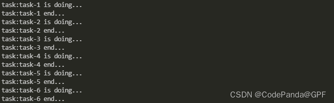
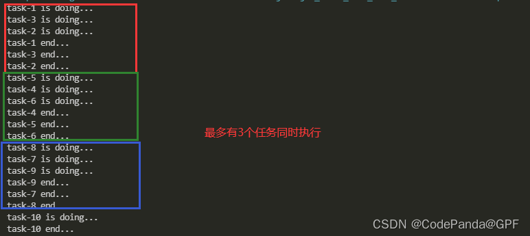
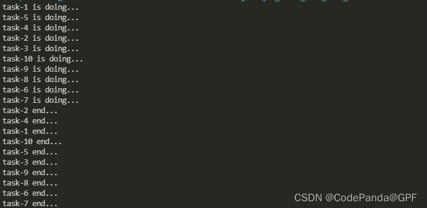
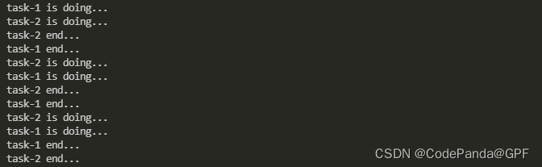
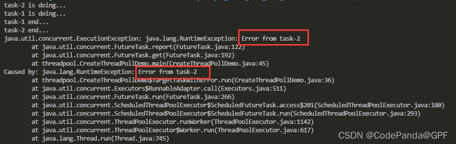
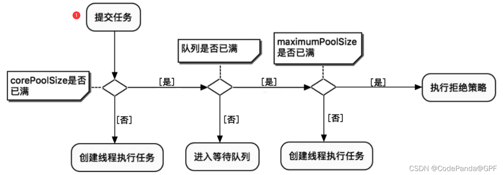
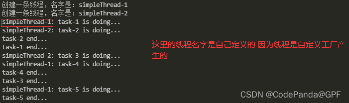
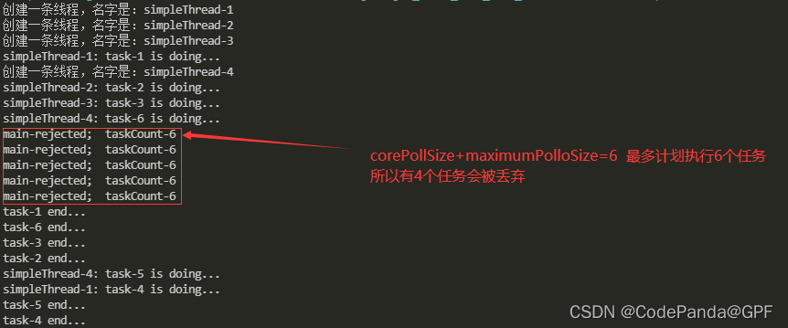

## 1. [线程池](https://so.csdn.net/so/search?q=线程池&spm=1001.2101.3001.7020)概念

创建Java线程需要给线程分配[堆栈](https://so.csdn.net/so/search?q=堆栈&spm=1001.2101.3001.7020)内存以及初始化内存，还需要进行系统调用，频繁地创建和销毁线程会大大降低系统的运行效率，采用线程池来管理线程有以下好处：

1. 提升性能：线程池能独立负责线程的创建、维护和分配
2. 线程管理：每个Java线程池会保持一些基本的线程统计信息，对线程进行有效管理

------

## 2. JUC线程池[架构](https://so.csdn.net/so/search?q=架构&spm=1001.2101.3001.7020)


**1. Executor**
Executor提供了execute()接口来执行已提交的Runnable执行目标实例,它只有1个方法：
`void execute(Runnable command)`

**2. ExecutorService**
继承于Executor,Java异步目标任务的“执行者服务接”口，对外提供异步任务的接收服务

```java
 	* @param task the task to submit
     * @param <T> the type of the task's result
     * @return a Future representing pending completion of the task
     * @throws RejectedExecutionException if the task cannot be
     *         scheduled for execution
     * @throws NullPointerException if the task is null
     */
    <T> Future<T> submit(Callable<T> task);//向线程池提交单个异步任务


//想线程池提交批量异步任务
 <T> List<Future<T>> invokeAll(Collection<? extends Callable<T>> tasks,
                                  long timeout, TimeUnit unit)
        throws InterruptedException;

```

**3. AbstractExecutorService**
抽象类，实现了ExecutorService

**4. ThreadPoolExecutor**
线程池实现类，继承于AbstractExecutorService，JUC线程池的**核心实现类**

**5. ScheduledExecutorService**
继承于ExecutorService。它是一个可以完成“延时”和“周期性”任务的调度线程池接口

**6. ScheduledThreadPoolExecutor**
继承于ThreadPoolExecutor，实现了ExecutorService中延时执行和周期执行等抽象方法

**7. Executors**
静态工厂类，它通过静态工厂方法返回***\*ExecutorService\****、**ScheduledExecutorService**等线程池示例对象

------

## 3. Executors创建线程的4种方法

**1. newSingleThreadExecutor创建“单线程化线程池”**

```java
package threadpool;
import java.util.concurrent.ExecutorService;
import java.util.concurrent.Executors;
import java.util.concurrent.atomic.AtomicInteger;

public class CreateThreadPollDemo {
    public static final int SLEEP_GAP=1000;
    static class TargetTask implements Runnable{
        static AtomicInteger taskNo=new AtomicInteger(1);
        private String taskName;
        public TargetTask()
        {
            taskName="task-"+taskNo;
            taskNo.incrementAndGet();
        }
        public void run()
        {
            System.out.println("task:"+taskName+" is doing...");
            try {
                Thread.sleep(SLEEP_GAP);
            } catch (InterruptedException e) {
                e.printStackTrace();
            }
            System.out.println("task:"+taskName+" end...");
        }
    }
    public static void main(String[] args) {
        ExecutorService pool=Executors.newSingleThreadExecutor();
        for(int i=0;i<3;i++)
        {
            pool.execute(new TargetTask());
            pool.submit(new TargetTask());
        }
        pool.shutdown();
    }
  
}
```



特点：

- 单线程化的线程池中的任务是按照提交的次序顺序执行的
- 只有一个线程的线程池
- 池中的唯一线程的存活时间是无限的
- 当池中的唯一线程正繁忙时，新提交的任务实例会进入内部的阻塞队列中，并且其阻塞队列是无界的
- 适用场景：任务按照提交次序，一个任务一个任务地逐个执行的场景

**2. newFixedThreadPool创建“固定数量的线程池**

```java
package threadpool;
import java.util.concurrent.ExecutorService;
import java.util.concurrent.Executors;
import java.util.concurrent.atomic.AtomicInteger;

public class CreateThreadPollDemo {
    public static final int SLEEP_GAP=1000;
    static class TargetTask implements Runnable{
        static AtomicInteger taskNo=new AtomicInteger(1);
        private String taskName;
        public TargetTask()
        {
            taskName="task-"+taskNo;
            taskNo.incrementAndGet();
        }
        public void run()
        {
            System.out.println(taskName+" is doing...");
            try {
                Thread.sleep(SLEEP_GAP);
            } catch (InterruptedException e) {
                e.printStackTrace();
            }
            System.out.println(taskName+" end...");
        }
    }
    public static void main(String[] args) {
        ExecutorService pool=Executors.newFixedThreadPool(3);//创建含有3个线程的线程池
        for(int i=0;i<5;i++)
        {
            pool.execute(new TargetTask());
            pool.submit(new TargetTask());
        }
        pool.shutdown();
    }
  
}
```



特点：

- 如果线程数没有达到“固定数量”，每次提交一个任务线程池内就创建一个新线程，直到线程达到线程池固定的数量
- 线程池的大小一旦达到“固定数量”就会保持不变，如果某个线程因为执行异常而结束，那么线程池会补充一个新线程
- 在接收异步任务的执行目标实例时，如果池中的所有线程均在繁忙状态，新任务会进入阻塞队列中（无界的阻塞队列）

适用场景：

- 需要任务长期执行的场景
- CPU密集型任务

缺点：

- 内部使用无界队列来存放排队任务，当大量任务超过线程池最大容量需要处理时，队列无限增大，使服务器资源迅速耗尽

**3. newCachedThreadPool创建“可缓存线程池”**

```java
package threadpool;
import java.util.concurrent.ExecutorService;
import java.util.concurrent.Executors;
import java.util.concurrent.atomic.AtomicInteger;

public class CreateThreadPollDemo {
    public static final int SLEEP_GAP=1000;
    static class TargetTask implements Runnable{
        static AtomicInteger taskNo=new AtomicInteger(1);
        private String taskName;
        public TargetTask()
        {
            taskName="task-"+taskNo;
            taskNo.incrementAndGet();
        }
        public void run()
        {
            System.out.println(taskName+" is doing...");
            try {
                Thread.sleep(SLEEP_GAP);
            } catch (InterruptedException e) {
                e.printStackTrace();
            }
            System.out.println(taskName+" end...");
        }
    }
    public static void main(String[] args) {
        ExecutorService pool=Executors.newCachedThreadPool();
        for(int i=0;i<5;i++)
        {
            pool.execute(new TargetTask());
            pool.submit(new TargetTask());
        }
        pool.shutdown();
    }
  
}
```



特点：

- 在接收新的异步任务target执行目标实例时，如果池内所有线程繁忙，此线程池就会添加新线程来处理任务
- 线程池不会对线程池大小进行限制，线程池大小完全依赖于操作系统（或者说JVM）能够创建的最大线程大小
- 如果部分线程空闲，也就是存量线程的数量超过了处理任务数量，就会回收空闲（60秒不执行任务）线程

适用场景：

- 需要快速处理突发性强、耗时较短的任务场景，如Netty的NIO处理场景、REST API接口的瞬时削峰场景

缺点：

- 线程池没有最大线程数量限制，如果大量的异步任务执行目标实例同时提交，可能会因创建线程过多而导致资源耗尽

**4. newScheduledThreadPool创建“可调度线程池”**

- 延时性
- 周期性

```java
package threadpool;
import java.security.Policy;
import java.util.concurrent.ExecutorService;
import java.util.concurrent.Executors;
import java.util.concurrent.ScheduledExecutorService;
import java.util.concurrent.TimeUnit;
import java.util.concurrent.atomic.AtomicInteger;

public class CreateThreadPollDemo {
    public static final int SLEEP_GAP=1000;
    static class TargetTask implements Runnable{
        static AtomicInteger taskNo=new AtomicInteger(1);
        private String taskName;
        public TargetTask()
        {
            taskName="task-"+taskNo;
            taskNo.incrementAndGet();
        }
        public void run()
        {
            System.out.println(taskName+" is doing...");
            try {
                Thread.sleep(SLEEP_GAP);
            } catch (InterruptedException e) {
                e.printStackTrace();
            }
            System.out.println(taskName+" end...");
        }
    }
    public static void main(String[] args) throws InterruptedException {
       ScheduledExecutorService pool=Executors.newScheduledThreadPool(2);
       for(int i=0;i<2;i++)
       {
           pool.scheduleAtFixedRate(new TargetTask(), 0, 500, TimeUnit.MILLISECONDS);
           //参数1： task任务  
           //参数2： 首次执行任务的延迟时间
           //参数3： 周期性执行的时间
           //参数4： 时间单位

       }
       Thread.sleep(3000);//主线程睡眠时间越长 周期次数越多
        pool.shutdown();
    }
  
}
```



总结：Executors创建线程池的4种方法十分方便，但是构造器创建普通线程池、可调度线程池比较复杂，这些构造器会涉及大量的复杂参数，已经较少使用。

**Executors创建线程池存在的问题：**

1. 创建固定数量线程池的问题

```java
  public static ExecutorService newFixedThreadPool(int nThreads) {
        return new ThreadPoolExecutor(nThreads, nThreads,
                                      0L, TimeUnit.MILLISECONDS,
                                      new LinkedBlockingQueue<Runnable>());
    }
```

> 阻塞队列无界，队列很大，很有可能导致JVM出现OOM（Out Of Memory）异常，即[内存](https://so.csdn.net/so/search?q=内存&spm=1001.2101.3001.7020)资源耗尽

1. 创建单线程线程池的问题

```java
 public static ExecutorService newSingleThreadExecutor() {
        return new FinalizableDelegatedExecutorService
            (new ThreadPoolExecutor(1, 1,
                                    0L, TimeUnit.MILLISECONDS,
                                    new LinkedBlockingQueue<Runnable>()));
    }
```

> 问题和固定数量线程池一样，阻塞队列无界

1. 创建缓存线程池的问题

```java
 public static ExecutorService newCachedThreadPool() {
        return new ThreadPoolExecutor(0, Integer.MAX_VALUE,
                                      60L, TimeUnit.SECONDS,
                                      new SynchronousQueue<Runnable>());
    }
```

> 问题存在于其最大线程数量不设限上。由于其maximumPoolSize的值为Integer.MAX_VALUE（非常大），可以认为可以无限创建线程，如果任务提交较多，就会造成大量的线程被启动，很有可能造成OOM异常，甚至导致CPU线程资源耗尽

1. 创建可调度线程存在的问题

```java
 public static ScheduledExecutorService newScheduledThreadPool(int corePoolSize) {
        return new ScheduledThreadPoolExecutor(corePoolSize);
    }
 
 public ScheduledThreadPoolExecutor(int corePoolSize) {
        super(corePoolSize, Integer.MAX_VALUE, 0, NANOSECONDS,
              new DelayedWorkQueue());
    }
```

> 主要问题在于线程数不设上限

**总结：**

- newFixedThreadPool和newSingleThreadExecutor： 阻塞队列无界，会堆积大量任务导致OOM(内存耗尽)
- newCachedThreadPool和newScheduledThreadPool： 线程数量无上界，会导致创建大量的线程，从而导致OOM
- 建议直接使用线程池ThreadPoolExecutor的构造器

------

## 4. 线程池的标准创建方式

```java
public class ThreadPoolExecutor extends AbstractExecutorService {
 /**
     * Core pool size is the minimum number of workers to keep alive
     * (and not allow to time out etc) unless allowCoreThreadTimeOut
     * is set, in which case the minimum is zero.
     */
    private volatile int corePoolSize;//核心线程数，即使线程空闲也不会被收回

	/**
     * Maximum pool size. Note that the actual maximum is internally
     * bounded by CAPACITY.
     */
    private volatile int maximumPoolSize;//线程的上限

	 /**
     * Timeout in nanoseconds for idle threads waiting for work.
     * Threads use this timeout when there are more than corePoolSize
     * present or if allowCoreThreadTimeOut. Otherwise they wait
     * forever for new work.
     */
    private volatile long keepAliveTime;//线程的最大空闲时长
   
   /**
     * The queue used for holding tasks and handing off to worker
     * threads.  We do not require that workQueue.poll() returning
     * null necessarily means that workQueue.isEmpty(), so rely
     * solely on isEmpty to see if the queue is empty (which we must
     * do for example when deciding whether to transition from
     * SHUTDOWN to TIDYING).  This accommodates special-purpose
     * queues such as DelayQueues for which poll() is allowed to
     * return null even if it may later return non-null when delays
     * expire.
     */
    private final BlockingQueue<Runnable> workQueue;//任务的排队队列

 	private volatile ThreadFactory threadFactory;//新线程的产生方式
 	/**
     * Handler called when saturated or shutdown in execute.
     */
    private volatile RejectedExecutionHandler handler;//拒绝策略
}
```

**1. 核心线程和最大线程数量**

- corePoolSize用于设置核心（Core）线程池数量，参数maximumPoolSize用于设置最大线程数量
- 线程池接收到新任务，当前工作线程数少于corePoolSize, 即使有空闲的工作线程，也会创建新的线程来处理该请求，直到线程数达到corePoolSize
- 当前工作线程数多于corePoolSize数量，但小于maximumPoolSize数量，那么仅当任务排队队列已满时才会创建新线程
- maximumPoolSize被设置为无界值（如Integer.MAX_VALUE）时，线程池可以接收任意数量的并发任务

**2. BlockingQueue**

- BlockingQueue（阻塞队列）的实例用于暂时接收到的异步任务，如果线程池的核心线程都在忙，那么所接收到的目标任务缓存在阻塞队列中

**3. keepAliveTime**

- 空闲线程存活时间
- 用于设置池内线程最大Idle（空闲）时长（或者说保活时长）
- 超过这个时间，默认情况下Idle、非Core线程会被回收

注意：若调用了allowCoreThreadTimeOut(boolean)方法，并且传入了参数true，则keepAliveTime参数所设置的Idle超时策略也将被应用于核心线程

------

## 5. 向线程池提交任务的两种方式

1. execute方法
   `void execute(Runnable command)`: Executor接口中的方法
2. submit方法
   `<T> Future<T> submit(Callable<T> task);`
   `<T> Future<T> submit(Runnable task, T result);`
   `Future<?> submit(Runnable task);`
   这3个submit方法都是ExecutorService接口中的方法

两种方法的区别：

- execute()方法只能接收Runnable类型的参数，而submit()方法可以接收Callable、Runnable两种类型的参数
- Callable类型的任务是可以返回执行结果的，而Runnable类型的任务不可以返回执行结果
- submit()提交任务后会有返回值，而execute()没有
- submit()方便Exception处理

**1. 通过submit()返回的Future对象获取结果**

```java
package threadpool;
import java.util.concurrent.Callable;
import java.util.concurrent.ExecutionException;
import java.util.concurrent.Executors;
import java.util.concurrent.Future;
import java.util.concurrent.ScheduledExecutorService;
import java.util.concurrent.atomic.AtomicInteger;

public class CreateThreadPollDemo {
    public static void main(String[] args) throws InterruptedException {
       ScheduledExecutorService pool=Executors.newScheduledThreadPool(2);
       Future<Integer> future=pool.submit(new Callable<Integer>() {

        @Override
        public Integer call() throws Exception {
            return 123;
        }
           
       });
       try {
        Integer result=future.get();
        System.out.println("result:"+result);//123
    } catch (ExecutionException e) {
        e.printStackTrace();
    }
    Thread.sleep(1000);
    pool.shutdown();

    }
  
}

```

**2. 通过submit()返回的Future对象捕获异常**

```java
package threadpool;
import java.util.concurrent.Callable;
import java.util.concurrent.ExecutionException;
import java.util.concurrent.Executors;
import java.util.concurrent.Future;
import java.util.concurrent.ScheduledExecutorService;
import java.util.concurrent.atomic.AtomicInteger;

import javax.management.RuntimeErrorException;

public class CreateThreadPollDemo {
    public static final int SLEEP_GAP=1000;
    static class TargetTask implements Runnable{
        static AtomicInteger taskNo=new AtomicInteger(1);
        String taskName;
        public TargetTask()
        {
            taskName="task-"+taskNo;
            taskNo.incrementAndGet();
        }
        public void run()
        {
            System.out.println(taskName+" is doing...");
            try {
                Thread.sleep(SLEEP_GAP);
            } catch (InterruptedException e) {
                e.printStackTrace();
            }
            System.out.println(taskName+" end...");
        }
    }
    static class TargetTaskWithError extends TargetTask{
        public void run()
        {
            super.run();//执行父类的run方法
            throw new RuntimeException("Error from "+taskName);
        }
    }

    public static void main(String[] args) throws InterruptedException {
       ScheduledExecutorService pool=Executors.newScheduledThreadPool(2);
      pool.execute(new TargetTaskWithError());
      Future future=pool.submit(new TargetTaskWithError());
      try {
        if(future.get()==null)
          {
              System.out.println("No Exception");
          }
    } catch (ExecutionException e) {
      
        e.printStackTrace();
    }
    Thread.sleep(1000);
    pool.shutdown();

    }
  
}
```



> execute()方法在启动任务执行后，任务执行过程中可能发生的异常调用者并不关心。而通过submit()方法返回的Future对象（异步执行实例），可以进行异步执行过程中的异常捕获

------

## 6. 线程池的任务调度流程



1. 如果**当前工作线程数量小于核心线程数量**，执行器总是优先创建一个任务线程，而不是从线程队列中获取一个空闲线程
2. 如果**线程池中总的任务数量大于核心线程池数量**，新接收的任务将被加入**阻塞队列**中，一直到阻塞队列已满。
3. 当完成一个任务的执行时，执行器总是**优先从阻塞队列**中获取下一个任务，并开始执行，一直到阻塞队列为空
4. 在**核心线程池数量已经用完**、**阻塞队列也已经满**了的场景下，如果线程池接收到新的任务，将会为新任务创建一个线程（**非核心线程**），并且立即开始执行新任务
5. 在**核心线程都用完**、**阻塞队列已满**的情况下，一直会创建新线程去执行新任务，直到池内的线程总数**超出maximumPoolSize**。如果线程池的线程总数超过maximumPoolSize，线程池就会拒绝接收任务，当新任务过来时，会为新任务执行拒绝策略

注意点：

- 核心和最大线程数量、BlockingQueue队列等参数如果配置得不合理，可能会造成异步任务得不到预期的并发执行，造成严重的排队等待现象
- 线程池的调度器创建线程的一条重要的规则是：在corePoolSize已满之后，还需要等阻塞队列已满，才会去创建新的线程

example: 设置核心线程数量为1，阻塞队列为100，有5个任务待执行（假设极端情况下任务一直执行不接受），则只有1个任务可以被执行，其他4个任务在阻塞队列中，而不是创建新线程进行处理（阻塞队列未满）

------

## 7. ThreadFactory（线程工厂）

```java
public interface ThreadFactory {

    /**
     * Constructs a new {@code Thread}.  Implementations may also initialize
     * priority, name, daemon status, {@code ThreadGroup}, etc.
     *
     * @param r a runnable to be executed by new thread instance
     * @return constructed thread, or {@code null} if the request to
     *         create a thread is rejected
     */
    Thread newThread(Runnable r);
}
```

- ThreadFactory是Java线程工厂接口，只有1个方法，调用ThreadFactory的唯一方法newThread()创建新线程时，可以更改所创建的新线程的名称、线程组、优先级、守护进程状态等
- 使用Executors创建新的线程池时，可以指定工厂，未指定是默认使用线程池时，也可以基于ThreadFactory（线程工厂）创建，在创建新线程池时可

```java
 public static ExecutorService newFixedThreadPool(int nThreads, ThreadFactory);
 public static ExecutorService newFixedThreadPool(int nThreads) 
12
package threadpool;
import java.util.concurrent.ExecutorService;
import java.util.concurrent.Executors;
import java.util.concurrent.ThreadFactory;
import java.util.concurrent.atomic.AtomicInteger;


public class CreateThreadPollDemo {
    public static final int SLEEP_GAP=1000;
    static class TargetTask implements Runnable{
        static AtomicInteger taskNo=new AtomicInteger(1);
        String taskName;
        public TargetTask()
        {
            taskName="task-"+taskNo;
            taskNo.incrementAndGet();
        }
        public void run()
        {   
            
            System.out.println(Thread.currentThread().getName()+": "+taskName+" is doing...");

            try {
                Thread.sleep(SLEEP_GAP);
            } catch (InterruptedException e) {
                e.printStackTrace();
            }
            System.out.println(taskName+" end...");
        }
    }
    static class SimpleThreadFactory implements ThreadFactory{
        static AtomicInteger threadNo=new AtomicInteger(1);
        public Thread newThread(Runnable task) {
           String threadName="simpleThread-"+threadNo;
           System.out.println("创建一条线程，名字是："+threadName);
           threadNo.incrementAndGet();
           Thread thread=new Thread(task,threadName);
           thread.setDaemon(true);
           return thread;
    }
  

    public static void main(String[] args) throws InterruptedException {
     ExecutorService pool=Executors.newFixedThreadPool(2,new SimpleThreadFactory());
     // ExecutorService pool=Executors.newFixedThreadPool(2);
      for(int i=0;i<5;i++)
      {
          pool.submit(new TargetTask());
      }
     
    Thread.sleep(5000);
    pool.shutdown();

    }
  
}
}
```


使用默认线程工厂的情况如下：

```java
public static void main(String[] args) throws InterruptedException {
     //ExecutorService pool=Executors.newFixedThreadPool(2,new SimpleThreadFactory());
     ExecutorService pool=Executors.newFixedThreadPool(2);
      for(int i=0;i<5;i++)
      {
          pool.submit(new TargetTask());
      }
     
    Thread.sleep(5000);
    pool.shutdown();
12345678910
```


线程工厂和线程池工厂：
Executors为线程池工厂类，用于快捷创建线程池（Thread Pool）；ThreadFactory为线程工厂类，用于创建线程（Thread）

------

## 8. 任务阻塞队列

特点：在一个线程从一个空的阻塞队列中获取元素时线程会被阻塞，直到阻塞队列中有了元素；当队列中有元素后，被阻塞的线程会自动被唤醒

常见的几种阻塞队列的实现：

1. ArrayBlockingQueue：是一个数组实现的有界阻塞队列（有界队列），队列中的元素按FIFO排序，ArrayBlockingQueue在创建时必须设置大小
2. LinkedBlockingQueue：是一个基于链表实现的阻塞队列，按FIFO排序任务，可以设置容量（有界队列），不设置容量则默认使用Integer.Max_VALUE作为容量（无界队列）
3. PriorityBlockingQueue：是具有优先级的无界队列

------

## 9. 调度器的钩子方法

> 三个钩子方法存在于ThreadPoolExecutor类，这3个方法都是空方法，一般会在子类中重写

`protected void beforeExecute(Thread t, Runnable r) { }`: 任务执行之前的钩子方法
`protected void afterExecute(Runnable r, Throwable t) { }`： 任务执行之后的钩子方法
`protected void terminated() { }`： 线程池终止时的钩子方法

```java
package threadpool;
import java.util.concurrent.ExecutorService;
import java.util.concurrent.Executors;
import java.util.concurrent.LinkedBlockingQueue;
import java.util.concurrent.ThreadFactory;
import java.util.concurrent.ThreadPoolExecutor;
import java.util.concurrent.TimeUnit;
import java.util.concurrent.atomic.AtomicInteger;


public class CreateThreadPollDemo {
    public static final int SLEEP_GAP=1000;
    static class TargetTask implements Runnable{
        static AtomicInteger taskNo=new AtomicInteger(1);
        String taskName;
        public TargetTask()
        {
            taskName="task-"+taskNo;
            taskNo.incrementAndGet();
        }
        public void run()
        {   
            
            System.out.println(Thread.currentThread().getName()+": "+taskName+" is doing...");

            try {
                Thread.sleep(SLEEP_GAP);
            } catch (InterruptedException e) {
                e.printStackTrace();
            }
            System.out.println(taskName+" end...");
        }
    }
    static class SimpleThreadFactory implements ThreadFactory{
        static AtomicInteger threadNo=new AtomicInteger(1);
        public Thread newThread(Runnable task) {
           String threadName="simpleThread-"+threadNo;
           System.out.println("创建一条线程，名字是："+threadName);
           threadNo.incrementAndGet();
           Thread thread=new Thread(task,threadName);
           thread.setDaemon(true);
           return thread;
    }
  

    public static void main(String[] args) throws InterruptedException {
   
    ExecutorService pool=new ThreadPoolExecutor(2, 4, 60,TimeUnit.SECONDS, new LinkedBlockingQueue<>(2)){
        @Override
        protected void terminated()
        {
            System.out.println("调度器已停止...");
        }
        @Override
        protected void beforeExecute(Thread t,Runnable target)
        {
            System.out.println("前钩执行...");
            super.beforeExecute(t, target);
        }
        @Override
        protected void afterExecute(Runnable target,Throwable t)
        {
            System.out.println("后钩执行...");
            super.afterExecute(target, t);
        }
    };
    for(int i=0;i<5;i++)
        pool.execute(new TargetTask());
    Thread.sleep(5000);
    pool.shutdown();

    }
  
}
}
```


------

## 10. 线程池的拒绝策略

拒绝情况：

1. 线程池已经被关闭
2. 工作队列已满且maximumPoolSize已满

几种常见的拒绝策略：


1. AbortPolicy：拒绝策略

> 新任务就会被拒绝，并且抛出RejectedExecutionException异常。该策略是线程池默认的拒绝策略

1. DiscardPolicy：抛弃策略

> 新任务就会直接被丢掉，并且不会有任何异常抛出

1. DiscardOldestPolicy：抛弃最老任务策略

> 将最早进入队列的任务抛弃，从队列中腾出空间，再尝试加入队列(一般队头元素最老)

1. CallerRunsPolicy：调用者执行策略

> 新任务被添加到线程池时，如果添加失败，那么提交任务线程会自己去执行该任务，不会使用线程池中的线程去执行新任务

1. 自定义策略

```java
package threadpool;
import java.util.concurrent.ArrayBlockingQueue;
import java.util.concurrent.BlockingDeque;
import java.util.concurrent.BlockingQueue;
import java.util.concurrent.ExecutorService;
import java.util.concurrent.Executors;
import java.util.concurrent.LinkedBlockingQueue;
import java.util.concurrent.RejectedExecutionHandler;
import java.util.concurrent.ThreadFactory;
import java.util.concurrent.ThreadPoolExecutor;
import java.util.concurrent.TimeUnit;
import java.util.concurrent.atomic.AtomicInteger;


public class CreateThreadPollDemo {
    public static final int SLEEP_GAP=1000;
    static class TargetTask implements Runnable{
        static AtomicInteger taskNo=new AtomicInteger(1);
        String taskName;
        public TargetTask()
        {
            taskName="task-"+taskNo;
            taskNo.incrementAndGet();
        }
        public void run()
        {   
            
            System.out.println(Thread.currentThread().getName()+": "+taskName+" is doing...");

            try {
                Thread.sleep(SLEEP_GAP);
            } catch (InterruptedException e) {
                e.printStackTrace();
            }
            System.out.println(taskName+" end...");
        }
    }
    static class SimpleThreadFactory implements ThreadFactory{
        static AtomicInteger threadNo=new AtomicInteger(1);
        public Thread newThread(Runnable task) {
           String threadName="simpleThread-"+threadNo;
           System.out.println("创建一条线程，名字是："+threadName);
           threadNo.incrementAndGet();
           Thread thread=new Thread(task,threadName);
           thread.setDaemon(true);
           return thread;
    }
    static class CustomerIgnorePolicy implements RejectedExecutionHandler{

        @Override
        public void rejectedExecution(Runnable r, ThreadPoolExecutor executor) {
            System.out.println(Thread.currentThread().getName()+"-rejected;  taskCount-"+executor.getTaskCount());
            
        }
        
    }
  

    public static void main(String[] args) throws InterruptedException {
        int corePoolSize=2;//核心线程数
        int maximumPoolSize=4;//最大线程数
        long keepAlive=10;//空闲时间
        TimeUnit unit=TimeUnit.SECONDS;//时间单位
        BlockingQueue<Runnable> workQueue=new LinkedBlockingQueue<>(2);//阻塞队列
        ThreadFactory factory=new SimpleThreadFactory();//自定义线程工厂
        RejectedExecutionHandler policy=new CustomerIgnorePolicy();//自定义拒绝策略
        ThreadPoolExecutor pool=new ThreadPoolExecutor(corePoolSize,maximumPoolSize,keepAlive,unit,workQueue,factory,policy);
       
     pool.prestartAllCoreThreads();
    for(int i=0;i<11;i++)
        pool.execute(new TargetTask());
    Thread.sleep(5000);
    pool.shutdown();

    }
  
}
}
```



------

## 11. 线程池的关闭

线程池的5种状态：

```java
 // runState is stored in the high-order bits
    private static final int RUNNING    = -1 << COUNT_BITS;
    private static final int SHUTDOWN   =  0 << COUNT_BITS;
    private static final int STOP       =  1 << COUNT_BITS;
    private static final int TIDYING    =  2 << COUNT_BITS;
    private static final int TERMINATED =  3 << COUNT_BITS;
123456
```

1. RUNNING: 线程池创建之后的初始状态，这种状态下可以执行任务
2. SHUTDOWN：该状态下线程池不再接受新任务，但是会将工作队列中的任务执行完毕
3. STOP：该状态下线程池不再接受新任务，也不会处理工作队列中的剩余任务，并且将会中断所有工作线程
4. TIDYING：该状态下所有任务都已终止或者处理完成，将会执行terminated()钩子方法
5. TERMINATED：执行完terminated()钩子方法之后的状态

**几种状态的转换：**


**几种关闭线程池的方法：**

1. shutdown()方法

> 等待当前工作队列中的剩余任务全部执行完成之后，才会执行关闭，但是此方法被调用之后线程池的状态转为SHUTDOWN，线程池不会再接收新的任务

```java
 public void shutdown() {
        final ReentrantLock mainLock = this.mainLock;
        mainLock.lock();
        try {
            checkShutdownAccess();//检测权限
            advanceRunState(SHUTDOWN);//设置线程池状态
            interruptIdleWorkers();//中断空闲线程
            onShutdown(); // 钩子函数，用于清理一些资源
        } finally {
            mainLock.unlock();
        }
        tryTerminate();
    }
```

1. shutdownNow()方法

> 立即关闭线程池的方法，此方法会打断正在执行的工作线程，并且会清空当前工作队列中的剩余任务，返回的是尚未执行的任务

```java
 public List<Runnable> shutdownNow() {
        List<Runnable> tasks;
        final ReentrantLock mainLock = this.mainLock;
        mainLock.lock();
        try {
            checkShutdownAccess();//检测权限
            advanceRunState(STOP);//设置线程池状态
            interruptWorkers();//中断所有线程（工作线程以及空闲线程）
            tasks = drainQueue();//丢弃工作队列中的剩余任务
        } finally {
            mainLock.unlock();
        }
        tryTerminate();
        return tasks;
    }
```

1. awaitTermination()方法

> 等待线程池完成关闭, shutdown()与shutdownNow()方法之后，用户程序都不会主动等待线程池关闭完成

```java
public boolean awaitTermination(long timeout, TimeUnit unit)
        throws InterruptedException {
        long nanos = unit.toNanos(timeout);
        final ReentrantLock mainLock = this.mainLock;
        mainLock.lock();
        try {
            for (;;) {
                if (runStateAtLeast(ctl.get(), TERMINATED))
                    return true;
                if (nanos <= 0)
                    return false;
                nanos = termination.awaitNanos(nanos);
            }
        } finally {
            mainLock.unlock();
        }
    }
```

在设置的时间timeout内如果线程池完成关闭，返回true, 否则返回false


