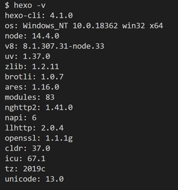
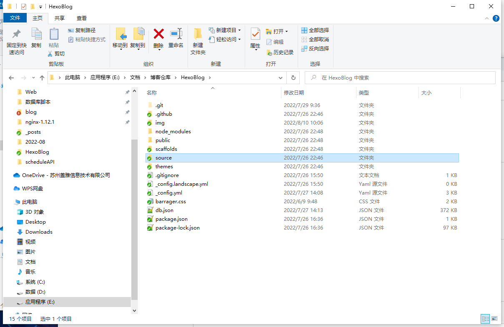
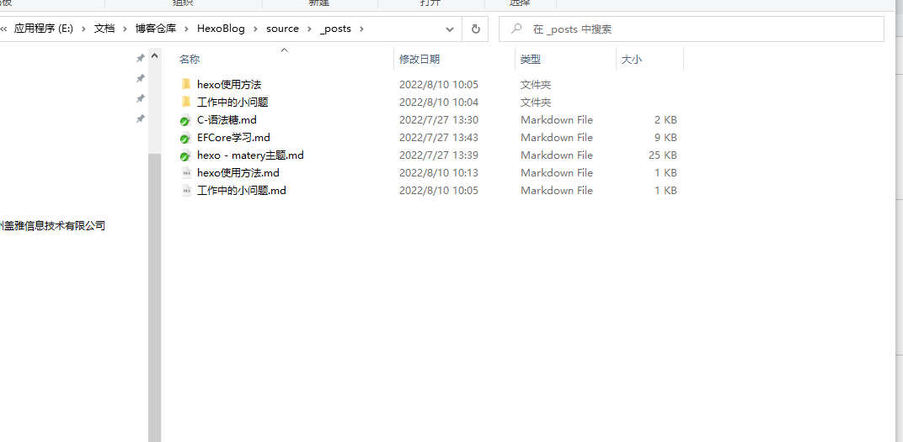

## 安装hexo

在vscode建立一个文件夹(例如0808prac)，右键打开终端，输入以下终端命令：
全局安装hexo：**npm install -g hexo-cli** （或者npm i -g hexo-cli）
查看是否安装成功：**hexo -v**

安装成功显示如下图：

## 创建hexo博客

- 创建项目：**hexo init 文件名** （例如hexo init my-blog）
- 进入创建好的项目：**cd 文件名** （例如cd my-blog）
- 安装依赖：**npm inistall** (或者npm i)
  生成的文件如下：关于文件的描述说明在Hexo官网有详细说明，在这里就不赘述了

## 写博客

创建一篇新文章或者新的页面：**hexo new 名字** (例如hexo new hexo使用方法)
生成一个hexo使用方法.md文档和一个文件夹

## 发布博客网站

详细文档参考：[vercel 部署](https://blog.17lai.site/posts/5311b619/#vercel-%E9%83%A8%E7%BD%B2)

