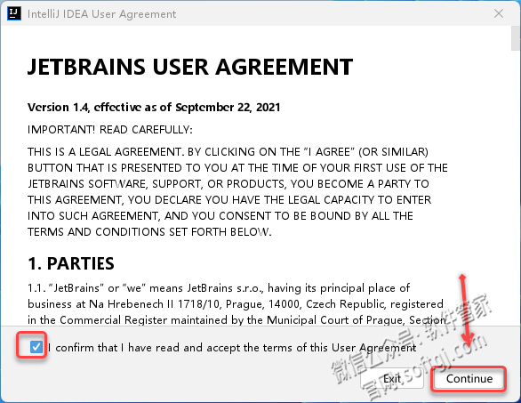
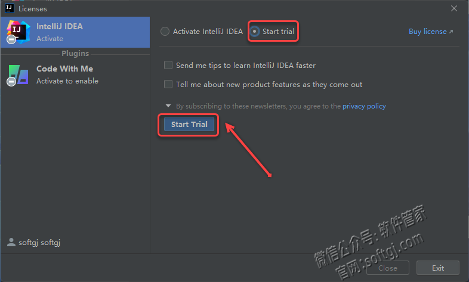
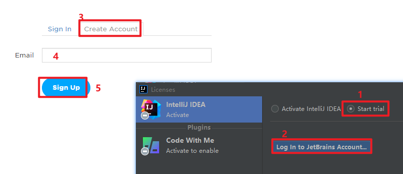
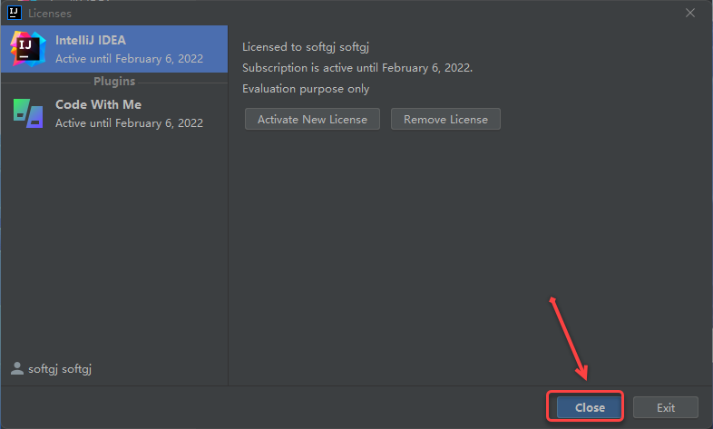
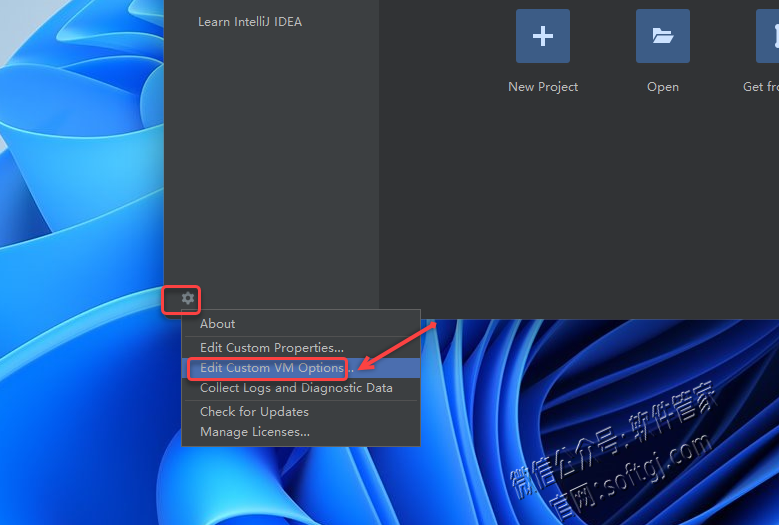

1.双击桌面【IntelliJ IDEA 2021.3.1】图标启动软件。

2.勾选【I confirm……】，点击【Continue】。

3.点击【Don't Send】。

4.点击【Start Trial】，点击【Srart Trial】。

温馨提示：通常点击“Start Trial”后需要登录自己的JetBrains账户，第一次使用该产品的用户可点击“log in……”打开网页根据提示免费注册（如下图所示）。

5.点击【Close】。

6.点击【设置】图标，选择【Edit Custom VM Options……】。

7.将破解文件中的 Crack\ja-netfilter 复制到自己想要的位置

8.输入【-javaagent:复制到的位置\\\ja-netfilter.jar】， 点击【Save】。

9.安装成功！

