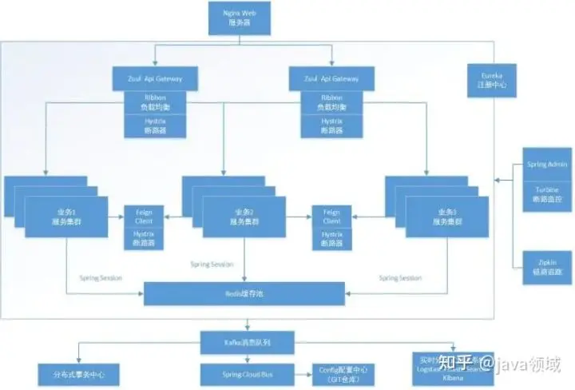
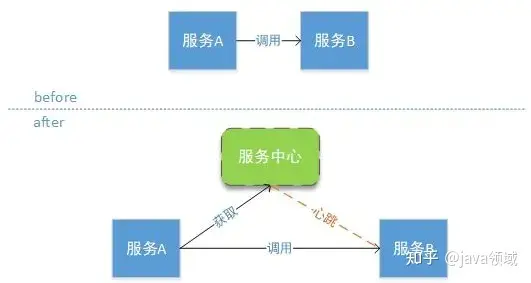
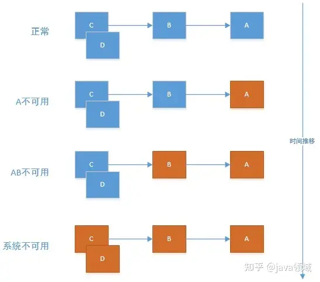
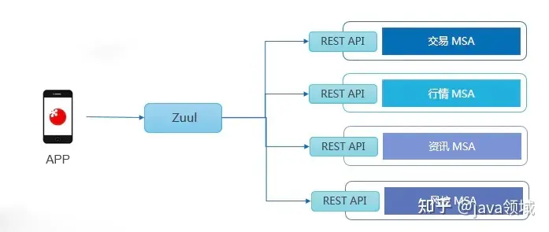
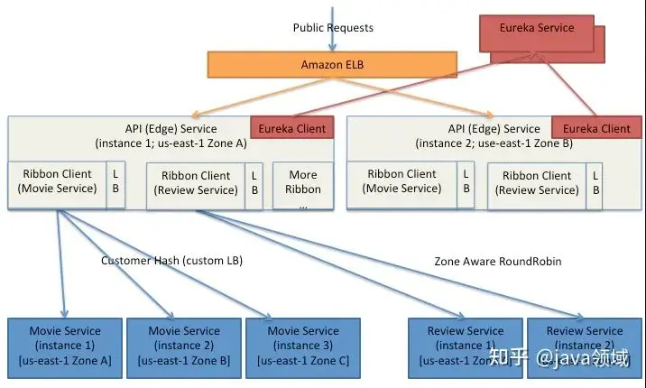

# 1. Spring Cloud简介

Spring Cloud是一系列框架的有序集合。它利用Spring Boot的开发便利性巧妙地简化了分布式系统基础设施的开发，如服务发现注册、配置中心、消息总线、负载均衡、断路器、数据监控等，都可以用Spring Boot的开发风格做到一键启动和部署。Spring并没有重复制造轮子，它只是将目前各家公司开发的比较成熟、经得起实际考验的服务框架组合起来，通过Spring Boot风格进行再封装屏蔽掉了复杂的配置和实现原理，最终给开发者留出了一套简单易懂、易部署和易维护的分布式系统开发工具包。

##    1.1 为什么考虑Spring Cloud 

- Spring Cloud来源于Spring，质量、稳定性、持续性都可以得到保证
- Spirng Cloud天然支持Spring Boot，更加便于业务落地。
- Spring Cloud发展非常的快，从16年开始接触的时候相关组件版本为1.x，到现在将要发布2.x系列
- Spring Cloud是Java领域最适合做微服务的框架。
- 相比于其它框架,Spring Cloud对微服务周边环境的支持力度最大。
- 对于中小企业来讲，使用门槛较低。

## 1.2 Spring Cloud的特性 

- 分布式/版本化配置
- 服务注册和发现
- 服务路由
- 服务和服务之间的调用
- 负载均衡
- 服务熔断与服务降级
- 分布式消息传递（MQ）

Spring Cloud的这些特性都是由不同的组件来完成，在架构的演进过程中扮演着重要的角色，接下来我们一起看看。

# 2. Spring Cloud体系工具框架

Spring Cloud共集成了19个子项目，里面都包含一个或者多个第三方的组件或者框架！
**Spring Cloud 体系包含以下工具框架：**
1、**Spring Cloud Config** 配置中心，利用git集中管理程序的配置。
2、**Spring Cloud Netflix** 集成众多Netflix的开源软件
3、**Spring Cloud Bus** 消息总线，利用分布式消息将服务和服务实例连接在一起，用于在一个集群中传播状态的变化
4、**Spring Cloud for Cloud Foundry** 利用Pivotal Cloudfoundry集成你的应用程序
5、**Spring Cloud Cloud Foundry Service Broker** 为建立管理云托管服务的服务代理提供了一个起点。
6、**Spring Cloud Cluster** 基于Zookeeper, Redis, Hazelcast, Consul实现的领导选举和平民状态模式的抽象和实现。
7、**Spring Cloud Consul** 基于Hashicorp Consul实现的服务发现和配置管理。
8、**Spring Cloud Security** 在Zuul代理中为OAuth2 rest客户端和认证头转发提供负载均衡
9、**Spring Cloud Sleuth** SpringCloud应用的分布式追踪系统，和Zipkin，HTrace，ELK兼容。
10、**Spring Cloud Data Flow** 一个云本地程序和操作模型，组成数据微服务在一个结构化的平台上。
11、**Spring Cloud Stream** 基于Redis,Rabbit,Kafka实现的消息微服务，简单声明模型用以在Spring Cloud应用中收发消息。
12、**Spring Cloud Stream App Starters** 基于Spring Boot为外部系统提供spring的集成
13、**Spring Cloud Task** 短生命周期的微服务，为SpringBooot应用简单声明添加功能和非功能特性。
14、**Spring Cloud Task App Starters**
15、**Spring Cloud Zookeeper** 服务发现和配置管理基于Apache Zookeeper。
16、**Spring Cloud for Amazon Web Services** 快速和亚马逊网络服务集成。
17、**Spring Cloud Connectors** 便于PaaS应用在各种平台上连接到后端像数据库和消息经纪服务。
18、**Spring Cloud Starters** （项目已经终止并且在Angel.SR2后的版本和其他项目合并）
19、**Spring Cloud CLI** 插件用Groovy快速的创建Spring Cloud组件应用。
下面将会介绍几个Spring Cloud体系中的重要组件。

## 2.1 Spring Cloud Netflix Eureka

Eureka是Netflix开源的一款提供服务注册和发现的产品，它提供了完整的Service Registry和Service Discovery实现。也是Spring Cloud体系中最重要最核心的组件之一。
Eureka是Spring Cloud体系的服务中心，将所有的可以提供的服务都注册到它这里来管理，其它各调用者需要的时候去注册中心获取，然后再进行调用，避免了服务之间的直接调用，方便后续的水平扩展、故障转移等。如下图：

当然服务中心这么重要的组件一但挂掉将会影响全部服务，因此需要搭建Eureka集群来保持高可用性，生产中建议最少两台。随着系统的流量不断增加，需要根据情况来扩展某个服务，Eureka内部已经提供均衡负载的功能，只需要增加相应的服务端实例既可。那么在系统的运行期间某个实例挂了怎么办？Eureka内容有一个心跳检测机制，如果某个实例在规定的时间内没有进行通讯则会自动被剔除掉，避免了某个实例挂掉而影响服务。
因此使用了Eureka就自动具有了注册中心、负载均衡、故障转移的功能。

## 2.2 Spring Cloud Hystrix 熔断器

在微服务架构中通常会有多个服务层调用，基础服务的故障可能会导致级联故障，进而造成整个系统不可用的情况，这种现象被称为服务雪崩效应。服务雪崩效应是一种因“服务提供者”的不可用导致“服务消费者”的不可用,并将不可用逐渐放大的过程。
如下图所示：A作为服务提供者，B为A的服务消费者，C和D是B的服务消费者。A不可用引起了B的不可用，并将不可用像滚雪球一样放大到C和D时，雪崩效应就形成了。

在这种情况下就需要整个服务机构具有故障隔离的功能，避免某一个服务挂掉影响全局。在Spring Cloud 中Hystrix组件就扮演这个角色。

Hystrix是Spring Cloud体系中的一个分布式系统限流、降级、熔断框架，Hystrix会在某个服务连续调用N次不响应的情况下，立即通知调用端调用失败，避免调用端持续等待而影响了整体服务。Hystrix间隔时间会再次检查此服务，如果服务恢复将继续提供服务。

Hystrix断路器可以防止一个应用程序多次试图执行一个操作，即很可能失败，允许它继续而不等待故障恢复或者浪费 CPU 周期，而它确定该故障是持久的。断路器模式也使应用程序能够检测故障是否已经解决。如果问题似乎已经得到纠正，应用程序可以尝试调用操作。

## 2.3 Spring Cloud Config

Spring Cloud Config是一个解决分布式系统的配置管理方案。它包含了Client和Server两个部分，Server提供配置文件的存储、以接口的形式将配置文件的内容提供出去，Client通过接口获取数据、并依据此数据初始化自己的应用。

其实就是Server端将所有的配置文件服务化，需要配置文件的服务实例去Config Server获取对应的数据。将所有的配置文件统一整理，避免了配置文件碎片化。
如果服务运行期间改变配置文件，服务是不会得到最新的配置信息，需要解决这个问题就需要引入Refresh。可以在服务的运行期间重新加载配置文件。
当所有的配置文件都存储在配置中心的时候，配置中心就成为了一个非常重要的组件。如果配置中心出现问题将会导致灾难性的后果，因此在生产中建议对配置中心做集群，来支持配置中心高可用性。

## 2.4 Spring Cloud Zuul

Spring Cloud Zuul是Netflix开源的微服务网关，他可以和Eureka,Ribbon,Hystrix等组件配合使用。Zuul组件的核心是一系列的过滤器，这些过滤器可以完成以下功能：

- 身份认证和安全: 识别每一个资源的验证要求，并拒绝那些不符的请求
- 审查与监控
- 动态路由：动态将请求路由到不同后端集群
- 压力测试：逐渐增加指向集群的流量，以了解性能
- 负载分配：为每一种负载类型分配对应容量，并弃用超出限定值的请求
- 静态响应处理：边缘位置进行响应，避免转发到内部集群
- 多区域弹性：跨域AWS Region进行请求路由，旨在实现ELB(ElasticLoad Balancing)使用多样化

##   2.5 Spring Cloud Ribbon 

Spring Cloud Ribbon组件主要用于提供客户侧的软件负载均衡算法。

Ribbon客户端组件提供一系列完善的配置选项，比如连接超时、重试、重试算法等。Ribbon内置可插拔、可定制的负载均衡组件。下面是用到的一些负载均衡策略：

- 简单轮询负载均衡
- 加权响应时间负载均衡
- 区域感知轮询负载均衡
- 随机负载均衡

Ribbon中还包括以下功能：

- 易于与服务发现组件（比如Netflix的Eureka）集成
- 使用Archaius完成运行时配置
- 使用JMX暴露运维指标，使用Servo发布
- 多种可插拔的序列化选择
- 异步和批处理操作（即将推出）
- 自动SLA框架（即将推出）
- 系统管理/指标控制台（即将推出）
